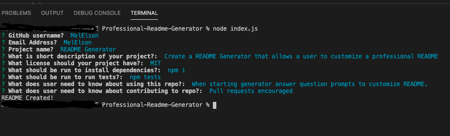

# Project Title 
README Generator
# Description 
Create a README Generator that allows a user to customize a professional README
## Table of Contents
1. [Title](#title)
2. [Description](#Description)
3. [Installation](#Installation)
4. [Usage](#Usage)
5. [License](#License)
6. [Tests](#Tests)
6. [Questions](#Questions)
# Installation
npm i
# Usage
When generator starts answer question prompts to customize README
# License

This application is covered by the MIT license. 

# Contributing 
Pull requests are encouraged. Please make sure to update as appropriate 
# Tests
npm tests
# Questions:
## GitHub User name: 
MelElson
## Email address: 
MelElson@email.com
## Code

